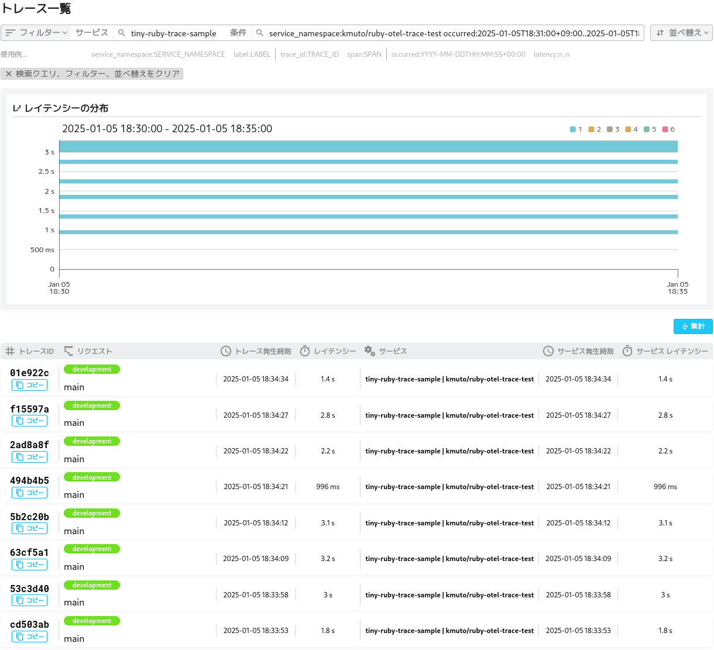

# ruby-otel-trace-test

RubyのOpenTelemetryトレース実装およびヘッドベースサンプリング、テールベースサンプリングの実験です。

## ビルド
OpenTelemetry Collectorがまだないか、この実験で使用するコンポーネントを含んでいない場合はビルドする必要があります（Go環境が必要です）。

```
$ go install github.com/open-telemetry/opentelemetry-collector-builder/cmd/otelcol-builder@v0.116.0
$ builder --config manifest.yaml
```

dist/otelcol-ruby-tracerが生成されます。

## Rubyのトレース発行プログラム
main.rbにトレースを手動計装しています。20個の親トレースを順に実行し、その中ではそれぞれ4個の子トレースが実行されます。

親トレースが8番目、16番目のとき、子トレースの2番目でエラー「Standard Error: 」を発生させるようにしています。

```
$ bundle exec ruby main.rb
start (PID 2667019): +....+....+....+....+....+....+....+.E..+....+....+....+....+....+....+....+.E..+....+....+....+....
```

## OpenTelemetry Collectorの実行
otel-col.yamlにOpenTelemetry Collectorの設定を用意しています。

[Mackerel]((https://ja.mackerel.io))のトレーシングサービスVaxilaに送るように設定しています。環境変数`MACKEREL_APIKEY`にAPIキーを設定してください。

Vaxila以外の別のトレーシングサービスに送るときにはexportersを適宜設定しましょう。

### ヘッドベースサンプリング
ヘッドベースサンプリングは、トレースを受け取ってすぐに確率的なサンプリングを行います（[probabilisticsamplerprocessor](https://github.com/open-telemetry/opentelemetry-collector-contrib/tree/main/processor/probabilisticsamplerprocessor)）。

otel-col.yamlの以下のprocessorsのほうを有効にします。

```
      processors: [resource/namespace, probabilistic_sampler, batch]
```

トレースの取捨選択の確率は以下で設定しています。

```
  probabilistic_sampler:
    mode: proportional
    sampling_percentage: 10
```

ここでは10としていて、トレースの10%だけを取り出します。
0を指定した場合は一切の抽出を行わず、100を指定した場合はサンプリングせずにすべて流すことになります。

### テールベースサンプリング
テールベースサンプリングは、複数のトレースをいったん蓄積し、設定したポリシーに従ってサンプリングします（[tailsamplingprocessor](https://github.com/open-telemetry/opentelemetry-collector-contrib/tree/main/processor/tailsamplingprocessor)）。

otel-col.yamlの以下のprocessorsのほうを有効にします。

```
      processors: [resource/namespace, tail_sampling, batch]
```

トレースの取捨選択は以下のように設定しています。

```
  tail_sampling:
    # decision_wait: 30s
    decision_wait: 10s
    # num_traces: 50000
    policies:
      - name: error-spans
        type: status_code
        status_code:
          status_codes: [ERROR]
      - name: sampling
        type: probabilistic
        probabilistic:
          sampling_percentage: 40
```

decision_waitは蓄積して判断するまでの時間、num_tracesは最大格納可能なトレース数です。
policiesには配列で順に評価していくポリシーを設定します。最初のポリシーに適合したトレースは、次のポリシーの評価に行くことなく抽出されます。

ここでは2つのポリシーを用意しています。

1. error-spans：トレースにステータスコード属性がERRORを含むスパンが存在したときには抽出する
2. sampling：それ以外のトレースについては40%の確率で抽出する

### 実行
OpenTelemetry Collectorを実行します。

```
dist/otelcol-ruby-tracer --config otel-col.yaml
```

別のターミナルでRubyプログラムを実行し、トレースがどのようにサンプリングされるかを確認しましょう。


